# 🎼 Symphony: Autonomous Harness Operating System

[](https://www.python.org/downloads/)
[](https://fastapi.tiangolo.com)
[](https://docs.pydantic.dev/)
[](https://nextjs.org/)
[](https://react.dev/)
[](https://reactflow.dev/)
[](tests/)
[](LICENSE)

> **A model-agnostic engineering orchestration control plane that coordinates specialized domain harnesses, maintains persistent platform-wide organizational memory, and closes the operational loop through continuous runtime telemetry and semantic knowledge extraction.**

---

## 🌐 Live Deployments & Interactive Links

| Component | Target Environment | URL |
| :--- | :--- | :--- |
| **Frontend Visualizer** | Vercel (Next.js 16 + React Flow) | [https://harness-engineering-murex.vercel.app](https://harness-engineering-murex.vercel.app) |
| **Backend Control Plane** | Render (FastAPI + Uvicorn) | [https://symphony-os.onrender.com](https://symphony-os.onrender.com) |
| **Interactive API Docs** | OpenAPI / Swagger UI | [https://symphony-os.onrender.com/docs](https://symphony-os.onrender.com/docs) |
| **Alternative API Docs** | ReDoc Interface | [https://symphony-os.onrender.com/redoc](https://symphony-os.onrender.com/redoc) |
| **Source Repository** | GitHub | [jacobjerryarackal/harness-engineering](https://github.com/jacobjerryarackal/harness-engineering) |

---

## 📑 Table of Contents

1. [Executive Summary & Core Distinctions](#1-executive-summary--core-distinctions)
2. [Why This Problem? The Limits of Bare LLMs](#2-why-this-problem-the-limits-of-bare-llms)
3. [What Problem Does Symphony Solve?](#3-what-problem-does-symphony-solve)
4. [What is Harness Engineering?](#4-what-is-harness-engineering)
5. [Project Philosophy & Core Principles](#5-project-philosophy--core-principles)
6. [Inspirations & Public Research](#6-inspirations--public-research)
7. [System Overview & How It Works](#7-system-overview--how-it-works)
8. [High-Level Design (HLD)](#8-high-level-design-hld)
9. [Low-Level Design (LLD)](#9-low-level-design-lld)
10. [End-to-End Working & Sequence Flow](#10-end-to-end-working--sequence-flow)
11. [Context Engineering](#11-context-engineering)
12. [The Engineering Harness Layer](#12-the-engineering-harness-layer)
13. [Hooks, Policies, & Guardrails](#13-hooks-policies--guardrails)
14. [Production Runtime & Tooling Simulation](#14-production-runtime--tooling-simulation)
15. [Shared Core Services & State Management](#15-shared-core-services--state-management)
16. [Closed-Loop Telemetry & Learning Engine](#16-closed-loop-telemetry--learning-engine)
17. [Verification Architecture & Quality Gates](#17-verification-architecture--quality-gates)
18. [Architecture Enforcement](#18-architecture-enforcement)
19. [Testing Strategy](#19-testing-strategy)
20. [CI/CD & Deployment Topology](#20-cicd--deployment-topology)
21. [Technology Stack](#21-technology-stack)
22. [Why Did We Choose This Tech Stack?](#22-why-did-we-choose-this-tech-stack)
23. [Architectural Decision Records (ADRs)](#23-architectural-decision-records-adrs)
24. [Failure Handling & Recovery](#24-failure-handling--recovery)
25. [Security & Guardrails](#25-security--guardrails)
26. [Observability & Telemetry](#26-observability--telemetry)
27. [Project Structure](#27-project-structure)
28. [Local Development & Quick Start](#28-local-development--quick-start)
29. [API Reference & Endpoint Specification](#29-api-reference--endpoint-specification)
30. [Frontend Control Plane Dashboard](#30-frontend-control-plane-dashboard)
31. [Before vs. After Comparison](#31-before-vs-after-comparison)
32. [Limitations](#32-limitations)
33. [Future Roadmap](#33-future-roadmap)
34. [Engineering Lessons](#34-engineering-lessons)
35. [References & Citations](#35-references--citations)
36. [License](#36-license)

---

## 1. Executive Summary & Core Distinctions

Modern software engineering with artificial intelligence often conflates raw reasoning capability with end-to-end software delivery. In reality, a foundation model alone cannot guarantee reliable software outcomes. 

To understand **Symphony**, one must first understand three distinct concepts:

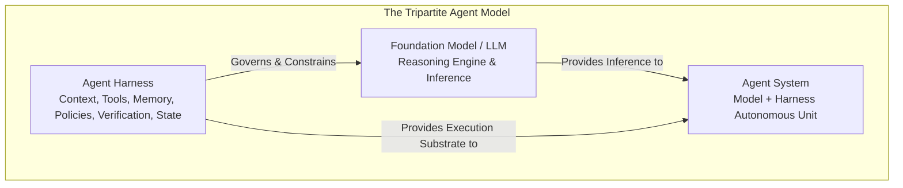

### The Three Pillars

1. **The Model (`LLM`)**: The underlying neural network (e.g., GPT-4, Claude 3.5, Gemini 1.5). It provides statistical pattern matching, natural language parsing, and code syntax synthesis. It has no persistent memory across sessions, no native filesystem access, no awareness of organizational rules, and no mechanism to verify its own correctness.
2. **The Harness (`Operating Environment`)**: The surrounding deterministic software harness that controls:
   - What context the model sees (and when).
   - What tools and domain capabilities are made available.
   - What organizational policies, types, and architectural constraints are enforced.
   - How outputs are tested, validated, and converted into hard evidence.
   - How runtime failures are captured, analyzed, and persisted as organizational memory.
3. **The Agent (`System Outcome`)**: The resulting entity formed by `Model + Harness`. An agent's reliability is bounded not by model intelligence alone, but by the rigor of its harness.

> **Crucial Architectural Scope**  
> Symphony is an **Autonomous Harness Operating System** designed for engineering orchestration, domain routing, context assembly, telemetry capture, and closed-loop learning. It intentionally decouples control plane orchestration from model inference. Instead of generating ungrounded code in a single prompt, Symphony produces verifiable **runtime orchestration artifacts** (Execution Plans, Domain Artifacts, Telemetry Reports, Failure Post-Mortems, and Semantic Knowledge Triples).

---

## 2. Why This Problem? The Limits of Bare LLMs

### The Failure Modes of Monolithic AI Coding

When developers rely on bare LLMs or naive prompt loops for software engineering, systems break down due to structural limitations:

```text
❌ Prompt-Driven Engineering Anti-Pattern
Prompt ──► Massive Single Context Window ──► Hallucinated Output ──► "Looks Finished" ──► Manual Crash in Production
   ▲                                                                                              │
   └──────────────────────────────── Ephemeral / No Memory ───────────────────────────────────────┘
```

1. **Context Degradation & Prompt Pollution**: Forcing requirements, architecture blueprints, library research, source code, test suites, and deployment scripts into a single prompt window causes attention dilution, lost instructions, and fabricated APIs.
2. **Open-Loop Execution**: Traditional AI tools generate code and immediately terminate. They do not execute artifacts in target runtimes, gather exit codes, or capture operational exceptions.
3. **Transient Organizational Memory**: Learnings, test failures, and debugging breakthroughs vanish the instant an inference session terminates. The next task restarts from zero context.
4. **Lack of Domain Isolation**: Architectural planning, implementation, quality assurance, and deployment require distinct cognitive and procedural constraints. Combining them into one prompt degrades quality across all four.
5. **Unverified Claims of Success**: An LLM stating *"I have fixed the issue"* is not proof of resolution. Real engineering requires deterministic execution, test evidence, and policy compliance.

### Why Prompting Alone Is Insufficient

The solution is not simply to write longer prompts or wait for larger models. The goal is to **engineer the deterministic environment in which the model operates**.

$$\text{Reliable Engineering System} = \text{Reasoning Engine} + \text{Context Routing} + \text{Domain Specialization} + \text{Deterministic Verification} + \text{Closed-Loop Memory}$$

---

## 3. What Problem Does Symphony Solve?

Symphony replaces monolithic prompt loops with a structured, multi-domain control plane that enforces deterministic verification and continuous closed-loop learning.

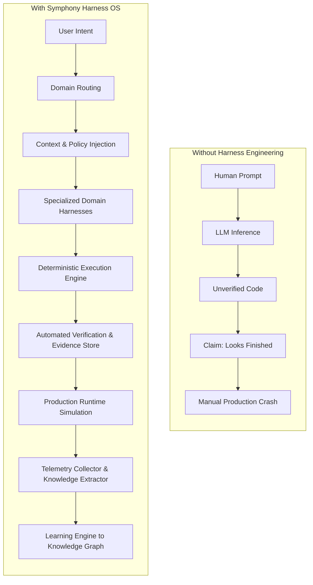

---

## 4. What is Harness Engineering?

**Harness Engineering** is the discipline of designing, implementing, and maintaining the software environment that surrounds, constrains, guides, and verifies autonomous AI agents.

### The Anatomy of an Engineering Harness

| Component | Responsibility in Symphony | Implementation Class |
| :--- | :--- | :--- |
| **Intent Routing** | Analyzes natural language goals and extracts required engineering domains. | `core.intent_analyzer.PatternIntentAnalyzer` |
| **Canonical Ordering** | Enforces chronological software development lifecycle phases. | `core.harness_router.DomainHarnessRouter` |
| **Domain Specialization** | Isolates single responsibilities (Spec, Arch, Eng, Eval, Deploy, Learn). | `harnesses.*` |
| **Context Assembly** | Dynamically hydrates execution state from policies, session vars, and RDF facts. | `core.context_manager.PlatformContextManager` |
| **Execution Gating** | Sequentially executes steps; immediately halts on unhandled errors. | `core.execution_engine.Engine` |
| **Evidence Validation** | Captures verifiable outputs (artifacts, test runs, exit codes) into an immutable store. | `memory.evidence_store.EvidenceStoreService` |
| **Closed-Loop Feedback** | Ingests production crash telemetry and updates platform memory (*"Loss becomes Information"*). | `runtime.*` |

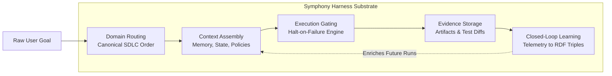

---

## 5. Project Philosophy & Core Principles

Every architectural layer in Symphony reflects concrete engineering principles implemented directly in source code:

1. **Model-Agnostic Control Plane**: Pure Python orchestration logic (`core/orchestrator.py`) decoupled from proprietary LLM API SDKs.
2. **Single-Responsibility Domain Isolation**: Capabilities are separated into distinct domain classes (`harnesses/`) inheriting from `Harness`.
3. **Progressive Context Disclosure**: Instead of flooding context with raw repository dumps, `PlatformContextManager` injects only active session variables, applicable policy rules, and relevant RDF triples.
4. **Deterministic Quality Gates**: The execution engine halts execution immediately when a harness fails or an assertion fails (`Engine.execute_plan()`).
5. **Evidence Over Assertion**: An agent's execution is not complete without concrete artifacts registered in `EvidenceStoreService`.
6. **Loss Becomes Information**: Operational failures and runtime exceptions are automatically parsed by `KnowledgeExtractor` and converted into permanent knowledge graph triples.

---

## 6. Inspirations & Public Research

This project is independently developed and draws inspiration from publicly available discussions and research on autonomous agent harnesses:

- **OpenAI Harness Engineering Research**: Drawing from OpenAI's public publications regarding model evaluation harnesses, benchmark sandboxing, and execution environments. Symphony applies these concepts to full-lifecycle software engineering.
- **Anthropic Context & Agent Workflows**: Applying findings from Anthropic's research on long-running agents, structured tool boundaries, and progressive context disclosure to prevent context window dilution.
- **Semantic Web & RDF Standards**: Utilizing Subject-Predicate-Object semantic triples (`KnowledgeGraphService`) to represent organizational learnings in a queryable, model-independent structure.

---

## 7. System Overview & How It Works

Symphony coordinates incoming goals through an end-to-end lifecycle spanning analysis, planning, execution, deployment simulation, and memory updating.

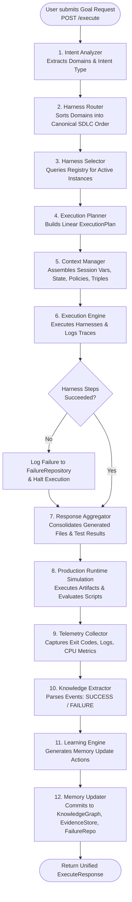

---

## 8. High-Level Design (HLD)

The following diagram represents the system-level architecture of Symphony, including the external API layer, control plane, engineering harnesses, shared core services, and runtime feedback loop.

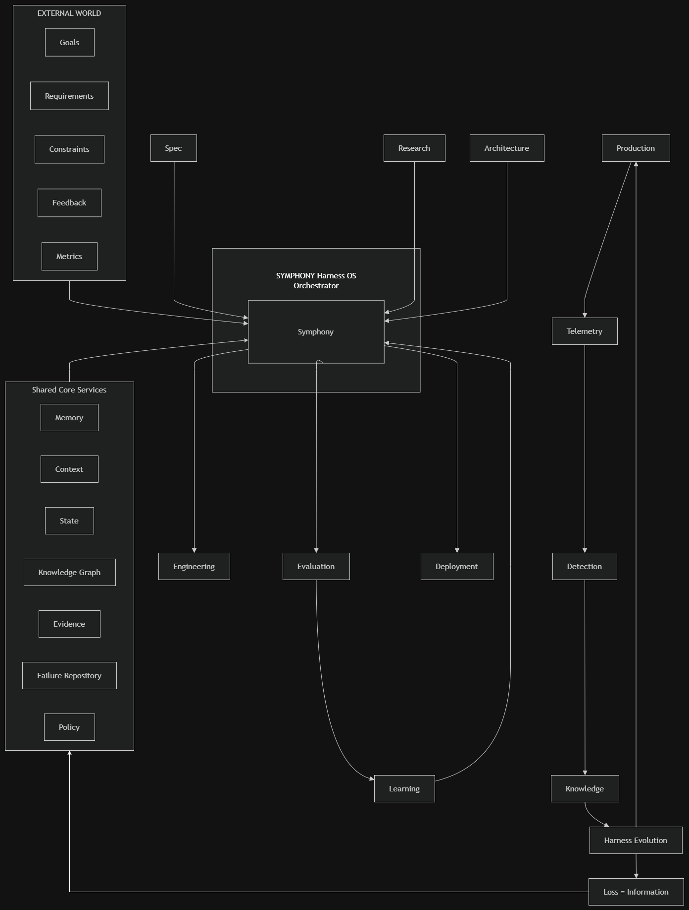

### 8.1 Architectural Layers & System Boundaries

The High-Level Architecture consists of five distinct layers:

1. **External Interface & API Layer (`app/`)**: Provides REST endpoints (`/execute`, `/memory`, `/knowledge-graph`, `/failures`, `/telemetry`, `/health`) and serves CORS-enabled responses to the Next.js frontend and external clients.
2. **Symphony Control Plane (`core/`)**: Coordinates the pipeline through intent analysis, canonical domain routing, harness selection, plan generation, context assembly, execution coordination, and response aggregation.
3. **Engineering Harness Layer (`harnesses/`)**: Implements single-responsibility engineering capabilities across seven domains: `Specification`, `Research`, `Architecture`, `Engineering`, `Evaluation`, `Deployment`, and `Learning`.
4. **Shared Core Services Layer (`memory/`)**: Maintains persistent, platform-wide organizational state across seven services: `MemoryService`, `ContextService`, `StateService`, `KnowledgeGraphService`, `EvidenceStoreService`, `FailureRepository`, and `PolicyEngineService`.
5. **Production Runtime & Feedback Loop (`runtime/`)**: Executes generated artifacts in target runtime environments, collects operational telemetry, extracts failure/success events, synthesizes memory updates, and commits them to shared services.

---

## 9. Low-Level Design (LLD)

The following diagram shows the internal pipeline execution flow of the Symphony Control Plane, detailing how data and execution contexts flow from stage to stage.

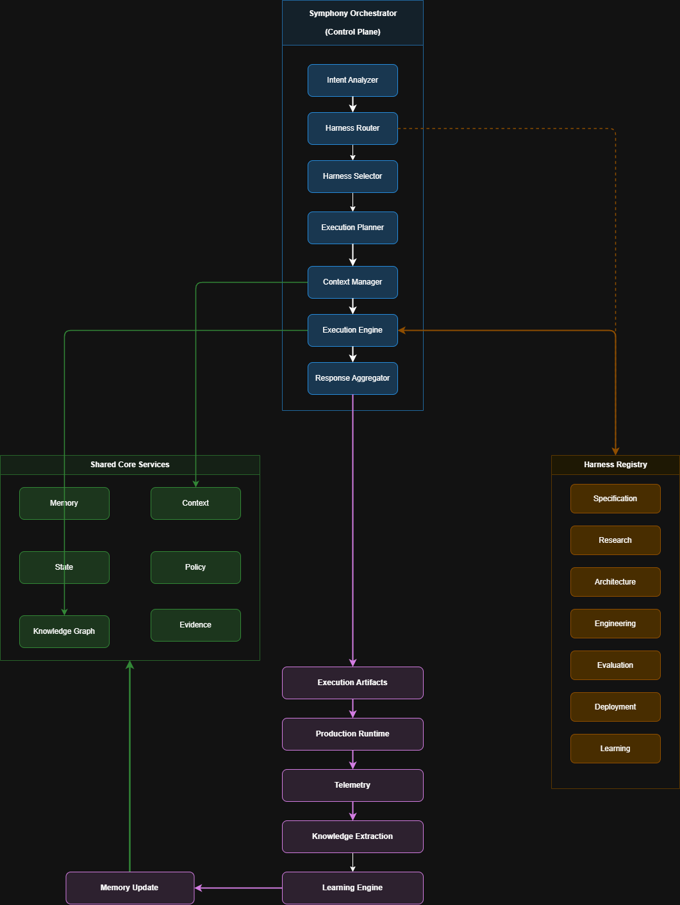

### 9.1 Control Plane Pipeline Stages

| Pipeline Stage | Implementation Class | Input | Output | Invariant / Behavior |
| :--- | :--- | :--- | :--- | :--- |
| **1. Intent Analysis** | `core.intent_analyzer.PatternIntentAnalyzer` | `request_text: str` | `Intent` | Maps keywords (`spec`, `research`, `code`, `test`, etc.) to `Domain` enums. |
| **2. Harness Routing** | `core.harness_router.DomainHarnessRouter` | `Intent` | `List[Domain]` | Sorts requested domains into canonical SDLC lifecycle order. |
| **3. Harness Selection** | `core.harness_selector.RegistryHarnessSelector` | `List[Domain]`, `HarnessRegistry` | `List[Harness]` | Retrieves instantiated harness objects matching the required domains. |
| **4. Execution Planning** | `core.execution_planner.SequentialExecutionPlanner` | `run_id: str`, `List[Harness]` | `ExecutionPlan` | Constructs sequential `ExecutionStep` instances with unique step IDs. |
| **5. Context Assembly** | `core.context_manager.PlatformContextManager` | `run_id: str` | `ExecutionContext` | Hydrates active session variables, state dictionary, policies, and RDF triples. |
| **6. Execution Engine** | `core.execution_engine.Engine` | `ExecutionPlan`, `ExecutionContext`, `Registry` | `List[HarnessResult]` | Executes steps in sequence, logs traces, propagates state updates, halts on error. |
| **7. Response Aggregation** | `core.response_aggregator.ArtifactAggregator` | `run_id: str`, `List[HarnessResult]` | `ExecutionArtifacts` | Consolidates generated files, test logs, deployment status, and overall success flag. |

---

## 10. End-to-End Working & Sequence Flow

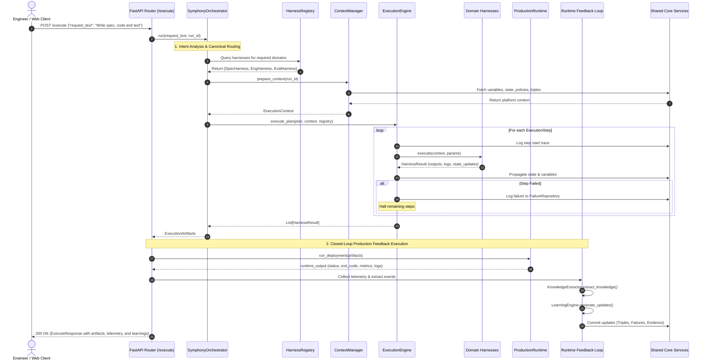

---

## 11. Context Engineering

Context in Symphony is actively managed through progressive assembly rather than static prompt dumps.

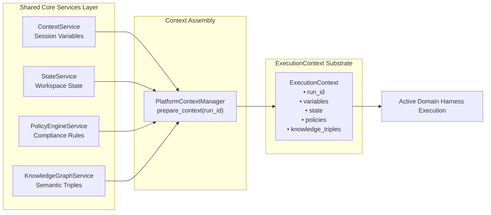

### Context Isolation & Variable Propagation

During execution, each harness receives an immutable reference to the `ExecutionContext`. When a harness finishes, its `updated_variables` and `updated_state` dictionaries are merged into the shared context before the next harness executes:

```python
# From core/execution_engine.py
result = harness.execute(context, step.parameters)
context.variables.update(result.updated_variables)
context.state.update(result.updated_state)
```

---

## 12. The Engineering Harness Layer

Symphony implements seven specialized domain harnesses inheriting from `harnesses.base.Harness`:

| Harness Class | Domain Enum | Primary Responsibility | Key Outputs | State/Variable Updates |
| :--- | :--- | :--- | :--- | :--- |
| `SpecificationHarness` | `SPECIFICATION` | Requirements specification & acceptance criteria generation | `generated_files["spec.md"]` | `specification_generated: True`<br>`last_active_phase: "SPECIFICATION"` |
| `ResearchHarness` | `RESEARCH` | Technical investigation & dependency analysis | `outputs["research_notes"]` | `research_completed: True`<br>`last_active_phase: "RESEARCH"` |
| `ArchitectureHarness` | `ARCHITECTURE` | Component blueprints & schema design | `generated_files["architecture_blueprint.md"]` | `architecture_designed: True`<br>`last_active_phase: "ARCHITECTURE"` |
| `EngineeringHarness` | `ENGINEERING` | Implementation code synthesis & file generation | `generated_files[target_file]` | `code_written: True`<br>`last_active_phase: "ENGINEERING"` |
| `EvaluationHarness` | `EVALUATION` | Automated test suite execution & verification | `outputs["test_results"]` | `evaluation_success: bool`<br>`last_active_phase: "EVALUATION"` |
| `DeploymentHarness` | `DEPLOYMENT` | Release packaging & target environment deployment | `outputs["deployment_status"]` | `deployed: True`<br>`last_active_phase: "DEPLOYMENT"` |
| `LearningHarness` | `LEARNING` | Failure post-mortem analysis & semantic triple extraction | `outputs["learning_notes"]`<br>`outputs["new_triples"]` | `learnings_extracted: True`<br>`last_active_phase: "LEARNING"` |

---

## 13. Hooks, Policies, & Guardrails

Symphony implements deterministic policy checking via `memory.policy_engine.PolicyEngineService`.

### Policy Engine Interface

Policies are defined as callable predicate rules evaluated against active context dictionaries:

```python
PolicyRule = Callable[[Dict[str, Any]], bool]

class PolicyEngineService:
    def add_policy(self, policy_id: str, description: str, rule: Optional[PolicyRule] = None) -> None:
        self._policies[policy_id] = {"policy_id": policy_id, "description": description}
        if rule is not None:
            self._rules[policy_id] = rule

    def evaluate_policy(self, policy_id: str, context: Dict[str, Any]) -> bool:
        if policy_id not in self._policies:
            return True
        if policy_id in self._rules:
            return self._rules[policy_id](context)
        return True
```

### Why Mechanical Policies Beat Prompt Instructions

1. **Deterministic Guarantees**: A policy evaluation returns a boolean `True`/`False` rather than an ambiguous text reply.
2. **Pre-Execution Validation**: Checks can run before compute or tool invocation occurs.
3. **Auditability**: Policies and evaluation results are logged directly to `EvidenceStoreService`.

---

## 14. Production Runtime & Tooling Simulation

The `runtime.production.ProductionRuntime` class acts as the execution environment where Symphony artifacts are deployed and validated:

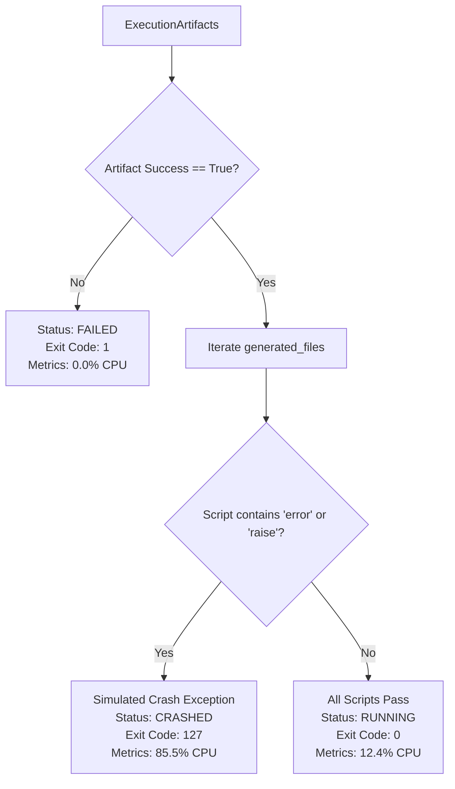

---

## 15. Shared Core Services & State Management

All orchestrator components and API endpoints access shared state through seven standardized platform services managed by the singleton dependency container (`app.dependencies.Container`):

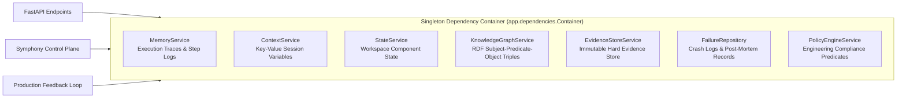

### Service Specifications

1. **`MemoryService` (`memory/memory_service.py`)**: Stores chronological execution traces per `run_id`.
2. **`ContextService` (`memory/context_service.py`)**: Manages ephemeral session key-value pairs shared between active harness steps.
3. **`StateService` (`memory/state_service.py`)**: Tracks persistent workspace state variables (e.g., active phase, build status).
4. **`KnowledgeGraphService` (`memory/knowledge_graph.py`)**: Stores semantic triples `(subject, predicate, object, metadata)` with pattern querying by subject, predicate, or object.
5. **`EvidenceStoreService` (`memory/evidence_store.py`)**: Records hard evidence records (`execution_artifacts`, `test_results`, generated code hashes) keyed by `run_id`.
6. **`FailureRepository` (`memory/failure_repository.py`)**: Persists structured incident records (`run_id`, `component`, `error_message`, `stack_trace`, `timestamp`).
7. **`PolicyEngineService` (`memory/policy_engine.py`)**: Manages registered compliance rules and evaluates them against input dictionaries.

---

## 16. Closed-Loop Telemetry & Learning Engine

The core differentiator of Symphony is its continuous runtime feedback loop: **"Loss becomes Information."**

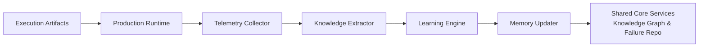

### Telemetry to Knowledge Transformation

1. **Collection (`TelemetryCollector`)**: Aggregates `status` (`RUNNING`, `CRASHED`, `FAILED`), `exit_code`, log strings, and hardware metrics.
2. **Extraction (`KnowledgeExtractor`)**: 
   - When `CRASHED`/`FAILED`: Emits a `FAILURE_EVENT` detailing specific exception messages.
   - When `RUNNING`: Emits a `SUCCESS_EVENT` confirming stable deployment.
3. **Learning Synthesis (`LearningEngine`)**:
   - For `FAILURE_EVENT`: Generates a `LOG_FAILURE` action and an `ADD_TRIPLE` action (`Run:{run_id}` $\rightarrow$ `encountered_failure` $\rightarrow$ `{error_msg}`).
   - For `SUCCESS_EVENT`: Generates an `ADD_TRIPLE` action (`Run:{run_id}` $\rightarrow$ `deployed_successfully` $\rightarrow$ `StableStatus`).
4. **Persistence (`MemoryUpdater`)**: Executes mutations against `KnowledgeGraphService`, `FailureRepository`, and `EvidenceStoreService`.

---

## 17. Verification Architecture & Quality Gates

Symphony adheres to the core axiom: **An agent claiming "done" is not proof of completion.**

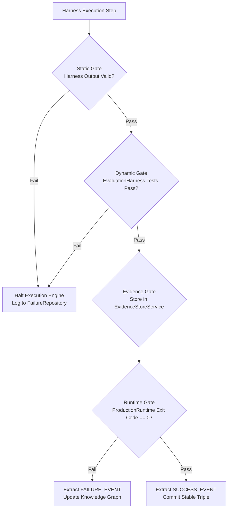

---

## 18. Architecture Enforcement

Symphony enforces architecture through mechanical constraints in code rather than documentation alone:

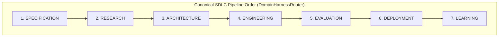

### Dependency Invariants

1. **Sequential Lifecycle Ordering**: If an incoming goal requires both `ENGINEERING` and `SPECIFICATION`, `DomainHarnessRouter` guarantees that `SPECIFICATION` executes before `ENGINEERING`.
2. **Separation of Concerns**: Domain harnesses cannot directly mutate other domain states; they communicate exclusively through the `ExecutionContext` mediated by `Engine`.
3. **Decoupled Delivery**: Control plane routing is model-agnostic and does not depend on external vendor APIs.

---

## 19. Testing Strategy

The test suite in `tests/` provides complete coverage across API routes, domain harnesses, shared memory services, orchestrator pipeline components, and the closed-loop runtime feedback engine.

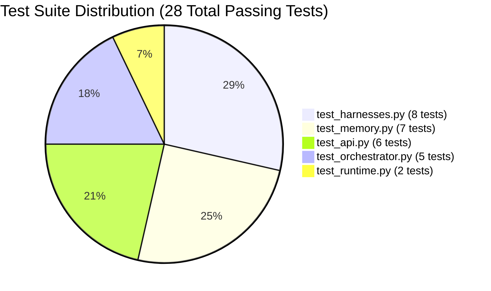

### Test Suite Breakdown

| Test File | Test Class | Coverage & Tested Assertions |
| :--- | :--- | :--- |
| `tests/test_api.py` | `TestAPIEndpoints` | Validates `GET /health`, `POST /execute`, `GET /memory`, `GET /knowledge-graph`, `GET /failures`, `GET /telemetry`. Verifies HTTP status codes and JSON schema integrity. |
| `tests/test_harnesses.py` | `TestHarnesses` | Validates `HarnessRegistry` registration/lookup and execution of all 7 harnesses (`Specification`, `Research`, `Architecture`, `Engineering`, `Evaluation`, `Deployment`, `Learning`). |
| `tests/test_memory.py` | `TestMemoryServices` | Validates all 7 shared core services (`MemoryService`, `ContextService`, `StateService`, `KnowledgeGraphService`, `EvidenceStoreService`, `FailureRepository`, `PolicyEngineService`). |
| `tests/test_orchestrator.py` | `TestOrchestratorControlPlane` | Tests keyword intent analysis, canonical domain routing order, registry lookup, plan generation, and full end-to-end `SymphonyOrchestrator.run()` execution. |
| `tests/test_runtime.py` | `TestRuntimeFeedbackLoop` | Tests both successful and crashed production runtime feedback loops, validating telemetry collection, event extraction, and knowledge graph updates. |

### Running the Test Suite

```bash
# Run pytest with root configuration
python -m pytest tests/ -v
```

---

## 20. CI/CD & Deployment Topology

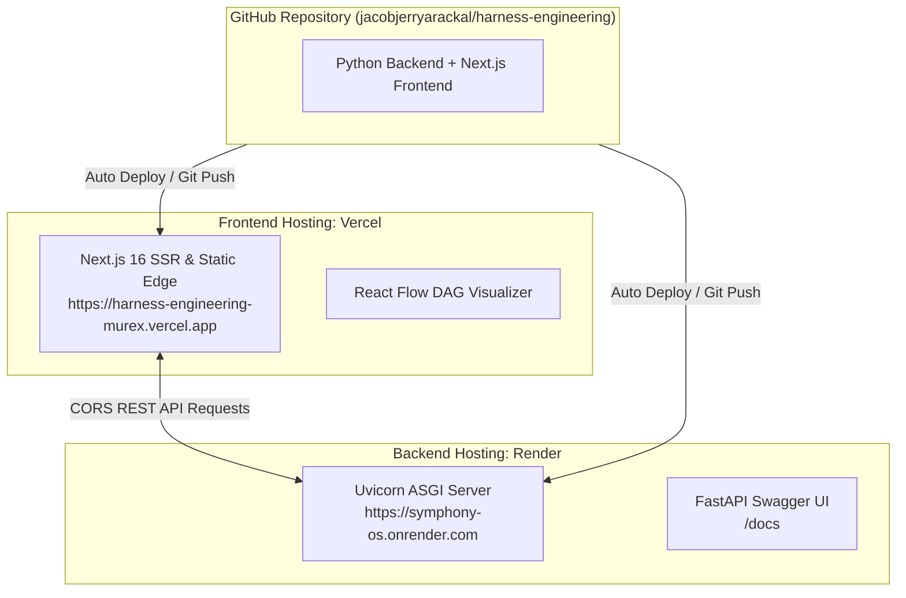

---

## 21. Technology Stack

| Layer / Subsystem | Technology | Version | Purpose in Symphony |
| :--- | :--- | :--- | :--- |
| **Backend Language** | Python | `3.10+` | Core control plane, harness execution engine, and memory services. |
| **API Framework** | FastAPI | `>=0.100.0` | Asynchronous REST API routing, OpenAPI schema generation, dependency injection. |
| **ASGI Web Server** | Uvicorn | `>=0.20.0` | High-performance asynchronous HTTP server. |
| **Data Validation** | Pydantic | `>=2.0.0` | Type-safe request/response validation schemas and serialization. |
| **HTTP Client** | HTTPX | `>=0.24.0` | Asynchronous client communication and integration testing. |
| **Configuration** | python-dotenv | Latest | Environment variable loading from `.env`. |
| **Test Runner** | Pytest | `>=8.0.0` | Automated test suite execution across 28 unit and integration tests. |
| **Frontend Framework** | Next.js | `16.2.10` | React server and client components, App Router, responsive page layout. |
| **UI Library** | React | `19.2.4` | Declarative UI component architecture. |
| **DAG Flow Visualizer** | React Flow (`@xyflow/react`) | `^12.11.2` | Interactive node graph animating real-time control plane execution. |
| **Styling** | Tailwind CSS | `^4.0.0` | Design system, responsive utility classes, and glassmorphism styling. |
| **Animation** | Framer Motion | `^12.42.2` | Micro-animations, view transitions, and status indicators. |
| **Iconography** | Lucide React | `^1.25.0` | Consistent iconography across views and dashboards. |
| **Data Visualization** | Recharts | `^3.9.2` | Telemetry performance and CPU utilization charts. |

---

## 22. Why Did We Choose This Tech Stack?

1. **Python for the Control Plane**:
   - Python is the de facto standard for AI systems, orchestration pipelines, and data manipulation.
   - Dataclasses and type hinting enable clean domain models (`interfaces.py`) without runtime overhead.
2. **FastAPI & Pydantic V2**:
   - FastAPI provides native async execution, automatic OpenAPI/Swagger documentation generation, and dependency injection (`app.dependencies.get_container`).
   - Pydantic V2 offers ultra-fast Rust-backed schema validation and serialization aliasing (`TripleModel.object` $\rightarrow$ `obj`).
3. **Next.js 16 & React 19**:
   - Next.js App Router provides optimal client/server rendering, fast hot-reloading during development, and zero-configuration Vercel deployment.
4. **React Flow (`@xyflow/react`)**:
   - Enables real-time visual representation of DAG execution pipelines. The 7-stage control plane transitions dynamically from idle (gray) to running (yellow) to success (green) or failure (red).
5. **In-Memory Singleton Container (`Container`)**:
   - Provides instantaneous state synchronization between `/execute` runs and `/memory`, `/knowledge-graph`, `/failures`, and `/telemetry` queries without external database dependencies.

---

## 23. Architectural Decision Records (ADRs)

### ADR-001: Separation of Control Plane Orchestrator from Model Inference
* **Status**: Accepted
* **Decision**: Orchestration logic (`core/orchestrator.py`) is decoupled from LLM providers and model APIs.
* **Rationale**: Prevents prompt pollution, isolates domain responsibilities, and allows model-agnostic harness testing.
* **Trade-Off**: Requires structured intent parsing and domain routing abstractions.

### ADR-002: In-Memory Singleton Dependency Injection Container
* **Status**: Accepted
* **Decision**: Manage shared core services via a centralized singleton dependency container (`app.dependencies.Container`).
* **Rationale**: Guarantees state consistency across concurrent REST API requests during live execution.
* **Trade-Off**: State is reset upon server process restart (designed for stateless cloud containers).

### ADR-003: Canonical SDLC Pipeline Ordering
* **Status**: Accepted
* **Decision**: Enforce a strict chronological ordering (`SPECIFICATION` $\rightarrow$ `RESEARCH` $\rightarrow$ `ARCHITECTURE` $\rightarrow$ `ENGINEERING` $\rightarrow$ `EVALUATION` $\rightarrow$ `DEPLOYMENT` $\rightarrow$ `LEARNING`).
* **Rationale**: Eliminates race conditions and ensures dependencies (e.g., specifications) exist before code generation begins.
* **Trade-Off**: Prevents out-of-order execution unless explicitly reconfigured.

### ADR-004: Closed-Loop Telemetry to Knowledge Graph Transformation
* **Status**: Accepted
* **Decision**: Production runtime outputs are automatically parsed for failure events and stored as RDF triples in `KnowledgeGraphService`.
* **Rationale**: Guarantees that organizational knowledge accumulates permanently over time (*"Loss becomes Information"*).
* **Trade-Off**: Knowledge graph size grows linearly with the number of executions.

---

## 24. Failure Handling & Recovery

Symphony handles errors gracefully at every level of the stack:

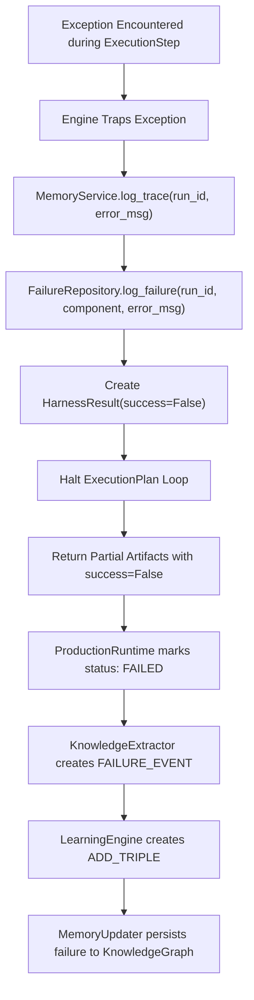

---

## 25. Security & Guardrails

| Security Domain | Implemented Guardrail in Symphony | Location |
| :--- | :--- | :--- |
| **CORS Policy** | Whitelist-restricted origins configurable via `ALLOWED_ORIGINS` environment variable. | `app/main.py` |
| **Input Validation** | Strict request schema parsing via Pydantic V2 models (`ExecuteRequest`). | `app/schemas/schemas.py` |
| **Error Isolation** | Exception shielding prevents server crashes; unhandled harness exceptions return structured `500` / `400` responses. | `app/routers/execute.py` |
| **Execution Gating** | Execution engine stops step propagation immediately upon error detection. | `core/execution_engine.py` |
| **Policy Compliance** | Predicate validation via `PolicyEngineService` before state updates. | `memory/policy_engine.py` |

---

## 26. Observability & Telemetry

Symphony provides complete visibility into system operations across four dedicated inspection endpoints:

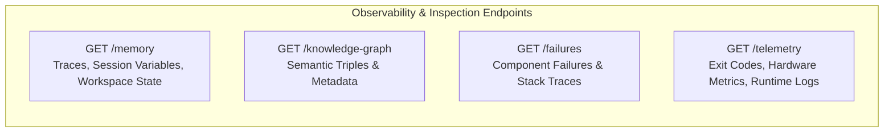

---

## 27. Project Structure

```text
harness-engineering/
├── .env.example                        # Template environment variables for backend
├── .gitignore                          # Git ignore rules for Python, Node, and caches
├── pytest.ini                          # Pytest root configuration (pythonpath = .)
├── requirements.txt                    # Backend dependencies (FastAPI, Uvicorn, Pydantic, etc.)
├── README.md                           # Comprehensive production documentation
├── SYSTEM_DESIGN.md                    # Technical system design specification
│
├── app/                                # FastAPI Web Application Layer
│   ├── main.py                         # Application entrypoint, CORS setup, and lifespan handlers
│   ├── dependencies.py                 # Singleton Container dependency injection setup
│   ├── routers/                        # API route controllers
│   │   ├── execute.py                  # POST /execute (Main orchestration & feedback pipeline)
│   │   ├── memory.py                   # GET /memory, /knowledge-graph, /failures, /telemetry
│   │   └── health.py                   # GET /health
│   └── schemas/                        # Pydantic V2 request & response validation schemas
│       └── schemas.py                  # Models: ExecuteRequest, ExecuteResponse, TripleModel, etc.
│
├── core/                               # Symphony Control Plane Core
│   ├── interfaces.py                   # Core dataclasses (Intent, ExecutionPlan, HarnessResult, etc.)
│   ├── orchestrator.py                 # SymphonyOrchestrator pipeline coordinator
│   ├── intent_analyzer.py              # PatternIntentAnalyzer keyword intent parser
│   ├── harness_router.py               # DomainHarnessRouter sequential SDLC ordering
│   ├── harness_selector.py             # RegistryHarnessSelector lookup
│   ├── execution_planner.py            # SequentialExecutionPlanner strategy generator
│   ├── context_manager.py              # PlatformContextManager context assembly
│   ├── execution_engine.py             # Engine sequential step coordinator & trace logger
│   └── response_aggregator.py          # ArtifactAggregator output consolidation
│
├── harnesses/                          # Specialized Engineering Harness Layer
│   ├── base.py                         # Abstract Harness base class
│   ├── registry.py                     # HarnessRegistry domain-to-harness mapping
│   ├── specification.py                # SpecificationHarness (spec.md generation)
│   ├── research.py                     # ResearchHarness (investigation & notes)
│   ├── architecture.py                 # ArchitectureHarness (architecture_blueprint.md)
│   ├── engineering.py                  # EngineeringHarness (source code generation)
│   ├── evaluation.py                   # EvaluationHarness (test execution & assertions)
│   ├── deployment.py                   # DeploymentHarness (runtime release packaging)
│   └── learning.py                     # LearningHarness (failure analysis & triples)
│
├── memory/                             # Shared Core Services & State Layer
│   ├── memory_service.py               # MemoryService (execution traces per run_id)
│   ├── context_service.py              # ContextService (session key-value variables)
│   ├── state_service.py                # StateService (workspace component state)
│   ├── knowledge_graph.py              # KnowledgeGraphService (RDF triple store & querying)
│   ├── evidence_store.py               # EvidenceStoreService (immutable evidence store)
│   ├── failure_repository.py           # FailureRepository (incident logs & stack traces)
│   └── policy_engine.py                # PolicyEngineService (compliance rules & checks)
│
├── runtime/                            # Production Runtime & Feedback Loop
│   ├── production.py                   # ProductionRuntime simulation environment
│   ├── telemetry.py                    # TelemetryCollector (logs, exit codes, metrics)
│   ├── knowledge_extraction.py         # KnowledgeExtractor (event pattern identification)
│   ├── learning_engine.py              # LearningEngine (update action generation)
│   └── memory_update.py                # MemoryUpdater (committing updates to shared services)
│
├── frontend/                           # Next.js 16 Web Dashboard
│   ├── package.json                    # Node dependencies (Next.js 16, React 19, React Flow)
│   ├── tsconfig.json                   # TypeScript configuration
│   ├── .env.example                    # Frontend environment variable template
│   └── src/
│       ├── app/                        # Next.js App Router (layout, global CSS, page)
│       ├── components/                 # React Flow DAG visualizer & tabbed inspection views
│       └── lib/                        # API fetch client (lib/api.ts)
│
├── docs/                               # Architectural Documentation Assets
│   └── architecture/                   # High-resolution HLD and LLD architectural diagrams
│       ├── hld.png                     # System High-Level Design diagram
│       └── lld.png                     # System Low-Level Design diagram
│
└── tests/                              # Automated Pytest Suite (28 Tests)
    ├── test_api.py                     # API route & status code tests
    ├── test_harnesses.py               # Harness registry & domain harness tests
    ├── test_memory.py                  # Shared core services & store tests
    ├── test_orchestrator.py            # Control plane orchestrator & pipeline tests
    └── test_runtime.py                 # Production runtime feedback loop tests
```

---

## 28. Local Development & Quick Start

### Prerequisites

- **Python 3.10+** (Tested on Python 3.11.9)
- **Node.js 18+** & **npm**

---

### Step 1: Clone the Repository

```bash
git clone https://github.com/jacobjerryarackal/harness-engineering.git
cd harness-engineering
```

---

### Step 2: Backend Setup & Testing

```bash
# 1. Create and activate a Python virtual environment
python -m venv venv
# On Linux/macOS:
source venv/bin/activate
# On Windows (PowerShell):
.\venv\Scripts\Activate.ps1

# 2. Install backend dependencies
pip install -r requirements.txt

# 3. Configure environment
cp .env.example .env

# 4. Run the automated test suite
python -m pytest tests/ -v

# 5. Start the Uvicorn ASGI server
uvicorn app.main:app --reload --host 127.0.0.1 --port 8000
```

The FastAPI backend will be live at `http://127.0.0.1:8000`.  
Access the interactive OpenAPI Swagger UI at `http://127.0.0.1:8000/docs`.

---

### Step 3: Frontend Dashboard Setup

In a separate terminal window:

```bash
cd frontend

# 1. Configure environment
cp .env.example .env.local

# 2. Install Node dependencies
npm install

# 3. Launch Next.js development server
npm run dev
```

Open `http://localhost:3000` in your browser to launch the Symphony Control Plane visualizer.

---

## 29. API Reference & Endpoint Specification

### 1. Execute Goal Pipeline

```http
POST /execute
Content-Type: application/json
```

#### Request Body
```json
{
  "request_text": "Write spec, research architecture, implement and test a Python module",
  "run_id": "demo-run-01"
}
```

#### Response Body (`200 OK`)
```json
{
  "run_id": "demo-run-01",
  "success": true,
  "intent": {
    "intent_type": "SPECIFICATION_TASK",
    "required_domains": [
      "SPECIFICATION",
      "RESEARCH",
      "ARCHITECTURE",
      "ENGINEERING",
      "EVALUATION"
    ]
  },
  "selected_harnesses": [
    "SPECIFICATION",
    "RESEARCH",
    "ARCHITECTURE",
    "ENGINEERING",
    "EVALUATION"
  ],
  "execution_plan": [
    { "step_id": "step_1_specification", "domain": "SPECIFICATION" },
    { "step_id": "step_2_research", "domain": "RESEARCH" },
    { "step_id": "step_3_architecture", "domain": "ARCHITECTURE" },
    { "step_id": "step_4_engineering", "domain": "ENGINEERING" },
    { "step_id": "step_5_evaluation", "domain": "EVALUATION" }
  ],
  "execution_artifacts": {
    "generated_files": {
      "spec.md": "# Specification Document...",
      "architecture_blueprint.md": "# Architecture Blueprint...",
      "output.py": "# Generated code\nprint('Hello from Symphony!')\n"
    },
    "test_results": {
      "passed": true,
      "failed": 0,
      "total_runs": 1,
      "details": "All tests passed successfully."
    },
    "deployment_status": null
  },
  "telemetry_summary": {
    "run_id": "demo-run-01",
    "status": "RUNNING",
    "exit_code": 0,
    "logs": [
      "Deploying artifacts for run: demo-run-01",
      "Executing script: spec.md",
      "Executing script: architecture_blueprint.md",
      "Executing script: output.py",
      "All scripts executed successfully in production."
    ],
    "metrics": {
      "cpu_utilization": 12.4
    },
    "timestamp": 1725114000.0
  },
  "learning_updates": [
    {
      "action": "ADD_TRIPLE",
      "subject": "Run:demo-run-01",
      "predicate": "deployed_successfully",
      "obj": "StableStatus",
      "metadata": { "type": "runtime_success" }
    }
  ]
}
```

---

### 2. Inspect Shared Memory & State

```http
GET /memory
```

#### Response Body (`200 OK`)
```json
{
  "traces": {
    "demo-run-01": [
      "Engine starting execution of plan containing 5 steps.",
      "Executing step: step_1_specification (Domain: SPECIFICATION)",
      "Step step_1_specification logs: Starting Specification Harness execution.; Created spec.md successfully.",
      "Executing step: step_2_research (Domain: RESEARCH)",
      "Engine finished plan execution. Total steps run: 5"
    ]
  },
  "context_variables": {
    "request_text": "Write spec, research architecture, implement and test a Python module",
    "specification_generated": true,
    "research_completed": true,
    "architecture_designed": true,
    "code_written": true,
    "evaluation_success": true
  },
  "project_state": {
    "last_active_phase": "EVALUATION"
  }
}
```

---

### 3. Query Semantic Knowledge Graph

```http
GET /knowledge-graph
```

#### Response Body (`200 OK`)
```json
[
  {
    "subject": "Run:demo-run-01",
    "predicate": "deployed_successfully",
    "obj": "StableStatus",
    "metadata": { "type": "runtime_success" }
  }
]
```

---

### 4. Query Failure Repository

```http
GET /failures
```

#### Response Body (`200 OK`)
```json
[
  {
    "run_id": "crash-test-01",
    "component": "ProductionRuntime",
    "error_message": "Runtime Exception in script buggy.py: simulated runtime failure.",
    "stack_trace": null,
    "timestamp": 1725114050.12
  }
]
```

---

### 5. Query Production Telemetry History

```http
GET /telemetry
```

#### Response Body (`200 OK`)
```json
[
  {
    "run_id": "demo-run-01",
    "status": "RUNNING",
    "exit_code": 0,
    "logs": [
      "Deploying artifacts for run: demo-run-01",
      "All scripts executed successfully in production."
    ],
    "metrics": {
      "cpu_utilization": 12.4
    },
    "timestamp": 1725114000.0
  }
]
```

---

### 6. Health Check

```http
GET /health
```

#### Response Body (`200 OK`)
```json
{
  "status": "healthy"
}
```

---

## 30. Frontend Control Plane Dashboard

The Next.js 16 frontend provides an interactive engineering cockpit with dark-mode styling:

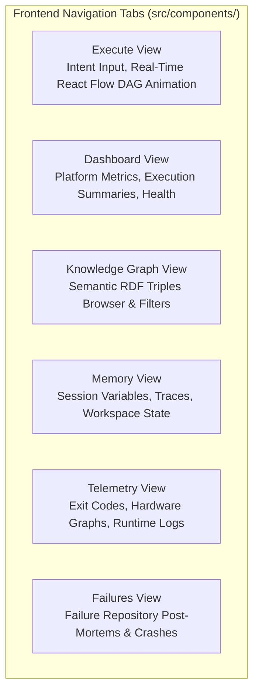

### Real-Time Visualizer State Transitions

In the React Flow graph, nodes transition dynamically based strictly on backend API response payload fields (`selected_harnesses` and `execution_plan`):

$$\text{Gray (Idle)} \longrightarrow \text{Yellow (Running)} \longrightarrow \begin{cases} \text{Green (Success)} \\ \text{Red (Failed)} \end{cases}$$

Unselected harnesses remain in the idle state, providing clear visual evidence of domain routing decisions.

---

## 31. Before vs. After Comparison

| Capability Dimension | Traditional AI Coding | Symphony Harness OS |
| :--- | :--- | :--- |
| **Execution Paradigm** | Prompt-driven monolithic inference | Environment-driven domain harness orchestration |
| **Context Management** | Ephemeral window prone to prompt pollution | Progressive context assembly via `PlatformContextManager` |
| **Verification** | Subjective assertion (*"Looks finished"*) | Objective test outputs in `EvidenceStoreService` |
| **Architecture Enforcement** | Implicit and unverified | Canonical SDLC ordering via `DomainHarnessRouter` |
| **Failure Recovery** | Manual prompt retries | Automated capture & post-mortems in `FailureRepository` |
| **Organizational Memory** | Disappears upon chat termination | Persistent RDF triples in `KnowledgeGraphService` |
| **Production Telemetry** | None (open-loop generation) | Closed-loop collection of exit codes, logs, and CPU metrics |
| **Domain Specialization** | Single prompt handles all roles | Dedicated domain harnesses (`Spec`, `Arch`, `Eng`, `Eval`, `Deploy`, `Learn`) |

---

## 32. Limitations

To maintain engineering integrity, current limitations of the implementation are explicitly documented:

1. **In-Memory Store Persistence**: Shared core services (`memory/*`) operate in-memory via the singleton container. Restarting the backend server process resets platform state (suitable for ephemeral container runtimes, but requires an external database for persistent multi-tenant deployments).
2. **Deterministic Pattern-Based Intent Routing**: `PatternIntentAnalyzer` uses deterministic keyword matching. While fast, transparent, and predictable, it does not currently invoke secondary LLM classifiers for ambiguous intent phrases.
3. **Simulated Production Runtime**: `ProductionRuntime` simulates artifact execution, exit codes, and hardware metrics. It does not spin up isolated Docker containers or sandboxed microVMs.
4. **Sequential Execution Engine**: Steps in the `ExecutionPlan` run sequentially; independent domains are not yet executed concurrently across parallel threads.

---

## 33. Future Roadmap

### Phase 1: Reliability & Persistence *(Planned)*
- [ ] **Persistent Database Adapters**: PostgreSQL and Redis backing for `KnowledgeGraphService`, `FailureRepository`, and `EvidenceStoreService`.
- [ ] **Docker / MicroVM Sandboxing**: Replace simulated runtime execution with isolated containerized sandboxes for running generated code safely.

### Phase 2: Parallelization & Multi-Agent Orchestration *(Planned)*
- [ ] **DAG Parallel Execution Engine**: Concurrent execution of independent domain harnesses (e.g., executing `ResearchHarness` and `SpecificationHarness` in parallel).
- [ ] **Dynamic Plugin Discovery**: Dynamic discovery and loading of external third-party harness plugins via entry points.

### Phase 3: Human-in-the-Loop & Governance *(Exploratory)*
- [ ] **Interactive Approval Checkpoints**: Webhook and UI confirmation gates prior to `DeploymentHarness` execution.
- [ ] **Policy DSL**: A domain-specific language for defining complex compliance rules without writing raw Python predicates.

---

## 34. Engineering Lessons

1. **Environment Over Model Size**: Improving the harness (context routing, state persistence, deterministic verification) yields far greater gains in reliability than upgrading the reasoning model alone.
2. **Evidence Over Assertion**: Autonomous systems must never be trusted based on textual self-reports. Reliability requires hard, machine-verifiable evidence (exit codes, test diffs, policy evaluations).
3. **Loss as Information**: Failures in autonomous execution are inevitable. When operational failures are captured, structured, and committed as semantic triples, every failure permanently increases organizational intelligence.

---

## 35. References & Citations

1. **OpenAI Harness Engineering Research**: Methodologies for agent evaluation environments, sandboxed execution, and multi-step benchmark harness design.
2. **Anthropic Agent Workflows & Context Isolation**: Architectural patterns for single-responsibility domain agents and progressive context disclosure.
3. **W3C Resource Description Framework (RDF)**: Standards for subject-predicate-object semantic data modeling.
4. **FastAPI & Pydantic Documentation**: Best practices for asynchronous Python REST API design and schema validation.
5. **React Flow / @xyflow/react**: Graph-based state machine visualization in React.

---

## 36. License

This project is licensed under the **MIT License**. See the [LICENSE](LICENSE) file for complete details.