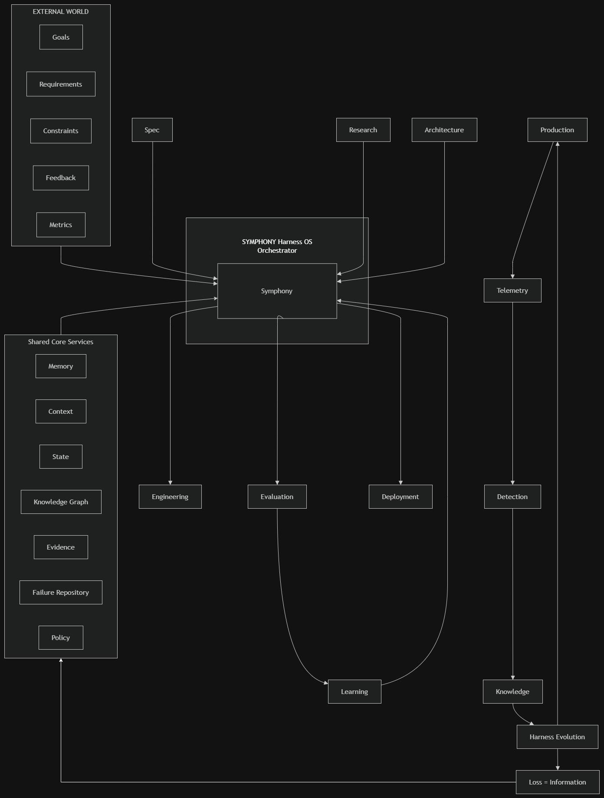
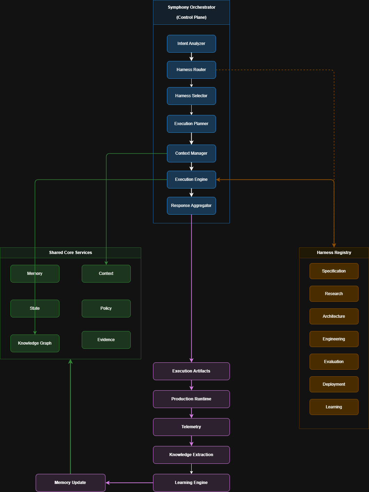

# 🎼 Symphony — System Design & Technical Architecture Document

> **Autonomous Harness Operating System**  
> *A model-agnostic engineering orchestration platform coordinating specialized harnesses across the complete software development lifecycle.*

---

## 1. Executive Overview

Modern AI coding assistants generate code effectively but lack a structured engineering lifecycle. Execution in isolation fails to preserve engineering intent, organizational memory, failure post-mortems, or reusable domain knowledge.

**Symphony** resolves this challenge by introducing an **Autonomous Harness Operating System**. Instead of acting as a monolithic coding agent, Symphony functions as a **Control Plane** that coordinates specialized, single-responsibility **Engineering Harnesses**, maintains persistent **Shared Core Services**, and closes the operational feedback loop through continuous **Production Runtime Telemetry**.

---

## 2. Problem Statement & Value Proposition

### Standard AI Coding Assistants vs. Symphony Harness OS

| Engineering Dimension | Traditional AI Coding Assistants | Symphony Harness OS |
| :--- | :--- | :--- |
| **Orchestration** | Monolithic prompt loops | Specialized Harness Control Plane |
| **Knowledge Retention** | Ephemeral context window | Persistent Shared Core Services & Knowledge Graph |
| **Operational Feedback** | Open-loop (stops at code generation) | Closed-loop (Telemetry → Learning Engine → Memory Update) |
| **Separation of Concerns** | Single prompt handles all roles | Dedicated Harnesses (Spec, Research, Arch, Eng, Eval, Deploy, Learn) |
| **Evidence Validation** | Unverified outputs | Hard evidence tracking in Evidence Store & Failure Repo |

---

## 3. Key Architectural Principles

1. **Model Agnostic**: Pure orchestration logic decoupled from underlying LLM inference providers.
2. **Harness-First Engineering**: Domain responsibilities isolated into modular, reusable harnesses (`Harness` abstract base class).
3. **Shared Organizational Intelligence**: Shared platform memory preventing duplicated reasoning across runs.
4. **Evidence-Driven Validation**: System outputs verified by explicit evidence storage (`EvidenceStoreService`).
5. **Continuous Learning Loop**: Production execution failures and metrics converted into persistent knowledge base triples (*"Loss becomes Information"*).

---

## 4. High-Level Design (HLD)


*Figure 1: High-Level Design — Symphony Control Plane Layering, Shared Core Services, and Closed-Loop Production Feedback.*

### 4.1 System Layering

The High-Level Architecture consists of five distinct layers:

1. **External World**: Stakeholders submit raw intent (requirements, constraints, features, bug fixes).
2. **Symphony Control Plane (`core.orchestrator.SymphonyOrchestrator`)**: Analyzes intent, routes requests, builds plans, and orchestrates harness execution.
3. **Harness Layer (`harnesses.*`)**: Modular domain harnesses that perform specialized engineering work.
4. **Shared Core Services (`memory.*`)**: Persistent platform memory, state, policies, knowledge graphs, evidence, and failure logs.
5. **Production Runtime (`runtime.*`)**: Executes generated artifacts, captures telemetry metrics, extracts operational insights, and applies learning updates back to Shared Core Services.

---

## 5. Low-Level Design (LLD) — Control Plane Pipeline


*Figure 2: Low-Level Design — Internal Pipeline Execution Flow of the Symphony Control Plane.*

### 5.1 Pipeline Stages & Implementation Mapping

| Pipeline Stage | Implementation Class | Responsibilities |
| :--- | :--- | :--- |
| **1. Intent Analysis** | `core.intent_analyzer.PatternIntentAnalyzer` | Parses input text into structured `Intent` (intent type, required domains). |
| **2. Harness Routing** | `core.harness_router.DomainHarnessRouter` | Orders required `Domain` enums sequentially into standard engineering order. |
| **3. Harness Selection** | `core.harness_selector.RegistryHarnessSelector` | Queries `harnesses.registry.HarnessRegistry` for matching domain harness instances. |
| **4. Strategy Planning** | `core.execution_planner.SequentialExecutionPlanner` | Generates a linear `ExecutionPlan` containing structured `ExecutionStep` items. |
| **5. Context Preparation**| `core.context_manager.PlatformContextManager` | Assembles `ExecutionContext` from session variables, workspace state, policies, and triples. |
| **6. Harness Execution** | `core.execution_engine.Engine` | Sequentially executes steps, logs execution traces, and propagates state/variable updates. |
| **7. Artifact Aggregation**| `core.response_aggregator.ArtifactAggregator` | Consolidates generated code files, test results, and deployment status into `ExecutionArtifacts`. |

---

## 6. Shared Core Services Architecture

All harnesses and orchestrator components interact with 7 standardized platform services defined in the `memory` module:

```text
               ┌─────────────────────────────────────────┐
               │         Shared Core Services            │
               ├────────────────────┬────────────────────┤
               │ MemoryService      │ ContextService     │
               │ StateService       │ KnowledgeGraph     │
               │ EvidenceStore      │ FailureRepository  │
               │ PolicyEngine       │                    │
               └────────────────────┴────────────────────┘
```

1. **`MemoryService` (`memory.memory_service`)**: Captures execution traces and step logs per `run_id`.
2. **`ContextService` (`memory.context_service`)**: Stores key-value session context variables shared across harnesses.
3. **`StateService` (`memory.state_service`)**: Tracks current workspace and project component state.
4. **`KnowledgeGraphService` (`memory.knowledge_graph`)**: Stores semantically linked RDF-style subject-predicate-object triples.
5. **`EvidenceStoreService` (`memory.evidence_store`)**: Records hard evidence (code artifacts, test outputs, execution evidence).
6. **`FailureRepository` (`memory.failure_repository`)**: Maintains incident post-mortems, crash details, and error messages.
7. **`PolicyEngineService` (`memory.policy_engine`)**: Evaluates compliance constraints and engineering rules against active context.

---

## 7. Harness Layer & Registry System

Engineering capabilities are encapsulated as domain implementations inheriting from `harnesses.base.Harness`:

* **`SpecificationHarness`** (`Domain.SPECIFICATION`): Generates engineering specifications and acceptance criteria.
* **`ResearchHarness`** (`Domain.RESEARCH`): Investigates technical options, patterns, and dependencies.
* **`ArchitectureHarness`** (`Domain.ARCHITECTURE`): Produces component designs, schemas, and system blueprints.
* **`EngineeringHarness`** (`Domain.ENGINEERING`): Generates application code, modules, and implementation files.
* **`EvaluationHarness`** (`Domain.EVALUATION`): Runs test suites, validates acceptance criteria, and measures performance.
* **`DeploymentHarness`** (`Domain.DEPLOYMENT`): Prepares deployment artifacts, container configurations, and release manifests.
* **`LearningHarness`** (`Domain.LEARNING`): Analyzes failure post-mortems and formulates platform memory updates.

The **`HarnessRegistry`** (`harnesses.registry`) maintains active domain instances and handles dynamic lookup during orchestration.

---

## 8. Closed-Loop Production Feedback & Learning Loop

Symphony implements a closed-loop runtime feedback mechanism:

```text
[ ExecutionArtifacts ]
          │
          ▼
[ ProductionRuntime ] ──── (Simulates environment deployment & execution)
          │
          ▼
[ TelemetryCollector ] ─── (Collects logs, exit codes, and metrics)
          │
          ▼
[ KnowledgeExtractor ] ─── (Extracts FAILURE_EVENT / SUCCESS_EVENT structures)
          │
          ▼
[ LearningEngine ] ─────── (Generates LOG_FAILURE & ADD_TRIPLE update actions)
          │
          ▼
[ MemoryUpdater ] ──────── (Applies updates to KnowledgeGraph, FailureRepo & EvidenceStore)
          │
          ▼
[ Shared Core Services ] ── (Enriches future orchestrator runs)
```

Guiding Philosophy: **"Loss becomes Information."** Operational failures automatically refine future harness executions.

---

## 9. Architectural Decision Records (ADRs)

### ADR 1: Control Plane Orchestration Over Monolithic Agents
* **Decision**: Separate orchestration (`core.orchestrator`) from execution (`harnesses.*`).
* **Rationale**: Prevents prompt pollution, isolates domain failures, and allows model-agnostic harness scaling.

### ADR 2: In-Memory Dependency Container (`app.dependencies.Container`)
* **Decision**: Manage shared core services via a centralized singleton dependency container.
* **Rationale**: Ensures state consistency across REST API endpoints (`/execute`, `/memory`, `/knowledge-graph`, `/failures`, `/telemetry`).

### ADR 3: Evidence Store Integration in Feedback Loop
* **Decision**: Mandate evidence persistence (`EvidenceStoreService`) during post-execution learning updates.
* **Rationale**: Guarantees auditable proof of code generation and test verification.

---

## 10. Repository Structure & Implementation Mapping

```text
Symphony/
├── README.md                           # Project overview & FastAPI showcase instructions
├── SYSTEM_DESIGN.md                    # Technical architecture specification
├── pytest.ini                          # Test runner root configuration
├── requirements.txt                    # Python dependencies (FastAPI, Pydantic V2, Uvicorn, Pytest)
│
├── app/                                # FastAPI Web API Layer
│   ├── main.py                         # Application entrypoint (CORS, Lifespan handler)
│   ├── dependencies.py                 # Singleton Container dependency injection
│   ├── routers/
│   │   ├── execute.py                  # POST /execute (Main workflow orchestration endpoint)
│   │   ├── memory.py                   # GET /memory, /knowledge-graph, /failures, /telemetry
│   │   └── health.py                   # GET /health
│   └── schemas/
│       └── schemas.py                  # Pydantic V2 request & response models
│
├── core/                               # Symphony Control Plane Core
│   ├── orchestrator.py                 # SymphonyOrchestrator main execution flow
│   ├── interfaces.py                   # Core dataclasses (Intent, ExecutionPlan, HarnessResult)
│   ├── intent_analyzer.py              # PatternIntentAnalyzer keyword parsing
│   ├── harness_router.py               # DomainHarnessRouter sequential ordering
│   ├── harness_selector.py             # RegistryHarnessSelector lookup
│   ├── execution_planner.py            # SequentialExecutionPlanner strategy
│   ├── context_manager.py              # PlatformContextManager context assembly
│   ├── execution_engine.py             # Engine sequential step coordinator
│   └── response_aggregator.py          # ArtifactAggregator output compilation
│
├── harnesses/                          # Domain Harness Implementations
│   ├── base.py                         # Abstract Harness base class
│   ├── registry.py                     # HarnessRegistry domain mapping
│   └── [specification, research, architecture, engineering, evaluation, deployment, learning].py
│
├── memory/                             # Shared Core Services Layer
│   └── [memory, context, state, knowledge_graph, evidence_store, failure_repository, policy_engine].py
│
├── runtime/                            # Production Feedback & Learning Loop
│   └── [production, telemetry, knowledge_extraction, learning_engine, memory_update].py
│
├── frontend/                           # Next.js / React Flow Interactive Control Plane UI
│   └── src/components/                # RealtimeFlow, ExecuteView, MemoryView, RightPanel
│
└── tests/                              # Automated Pytest Suite
    └── [test_api, test_harnesses, test_memory, test_orchestrator, test_runtime].py
```

---

## 11. Conclusion

Symphony establishes a model-agnostic **Autonomous Harness Operating System** that elevates AI software engineering from isolated code generation to structured orchestration. By decoupling control plane routing from specialized domain harnesses and integrating a continuous production learning loop, Symphony ensures every execution permanently enriches organizational intelligence.